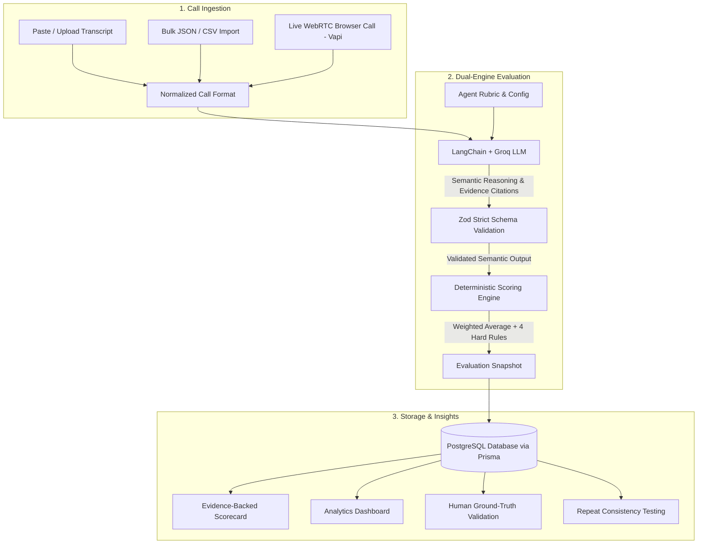

# 🎙️ Voice Agent Studio

> A configuration-first platform for creating voice AI agents, evaluating call transcripts, and analyzing agent performance with deterministic, evidence-backed scoring.

[](http://161.118.185.230/)
[](https://nextjs.org/)
[](https://www.typescriptlang.org/)
[](https://www.prisma.io/)
[](https://groq.com/)
[](https://www.docker.com/)

---

## 🌟 Overview

Most voice AI platforms focus solely on making calls. **Voice Agent Studio** solves the post-call evaluation challenge: **Agent Configuration + Call Evaluation + Real-time Analytics**.

It combines **LLM-powered semantic analysis** with a **100% deterministic, unit-tested scoring engine**, ensuring that AI never guesses final grades or pass/fail thresholds. Every score is directly justified by cited evidence turns from the call transcript.

---

## 🏛️ System Architecture & Workflow

The platform separates subjective semantic interpretation from objective numerical scoring:



### Detailed Evaluation Lifecycle

1. **Ingestion & Normalization**: Whether a transcript is pasted, uploaded via CSV/JSON, or generated through a real browser WebRTC call, it is normalized into a uniform speaker turn format.
2. **Semantic Extraction (Groq + LangChain)**: The LLM analyzes the conversation against the agent's criteria, providing a 1–5 score, detailed reasoning, and exact transcript turns cited as evidence.
3. **Zod Schema Validation**: Strict contract enforcement rejects malformed LLM responses outright.
4. **Deterministic Rule Engine (Pure TypeScript)**:
   - Calculates the exact mathematical weighted average.
   - Enforces **4 types of Hard Rules** (`criterion_below`, `any_below`, `not_assessable_fail`, `failure_tag_any`).
   - Determines the final **PASS / FAIL** grade without any LLM hallucination or drift.
5. **Config Snapshotting**: The evaluation permanently snapshots the agent configuration used at that moment, ensuring complete reproducibility even if the agent is edited later.

---

## 🚀 Key Features

- **No-Code Agent Configuration**: Configure agent persona, business goal, opening lines, operating guidelines, policy facts, language, and the target speaker to grade.
- **Dynamic Rubric Editor**: Weighted criteria with good/bad examples, combined with strict behavioral hard rules (e.g. *inventing a discount or policy violation triggers an immediate automatic failure*).
- **Evidence-Backed Scorecards**: Every criterion score displays verifiable transcript turn badges, linking directly to the cited conversational context.
- **Interactive Human Ground-Truth Validation**: Upload human-labeled benchmark CSVs directly in the UI (`Validation` page) to compute exact agreement, within-±1 accuracy, MAE (Mean Absolute Error), and PASS/FAIL alignment.
- **Evaluation Consistency Testing**: Re-run identical calls $N$ times to measure score variance, spread, and grade stability.
- **Live WebRTC Voice Calling (Vapi)**: Conduct instant, live audio calls in the browser with speech-to-text transcription directly evaluated by the scoring pipeline.
- **Modern Dark UI**: Clean, responsive interface built with Tailwind CSS, Lucide Icons, and accessible Radix UI primitives.

---

## 🛠️ Technology Stack

| Layer | Technologies |
|---|---|
| **Frontend** | Next.js 14 (App Router), React 18, TypeScript, Tailwind CSS, Radix UI, Lucide React, Vapi Web SDK |
| **Backend** | Node.js 20, Express, TypeScript, Prisma ORM, LangChain, Groq SDK, Zod, Multer |
| **Database** | PostgreSQL (Hosted on Neon Cloud) |
| **LLM Inference** | Groq LPU (`openai/gpt-oss-120b`) |
| **Deployment** | Docker, Docker Compose, Oracle Cloud Infrastructure (OCI) Ubuntu VM |

---

## 📁 Repository Structure

```
├── backend/
│   ├── prisma/             # Database schema (PostgreSQL)
│   ├── src/
│   │   ├── adapters/       # Transcript format parsers (CSV, JSON, plain text)
│   │   ├── ai/             # LangChain evaluator chains & scoring engines
│   │   ├── modules/        # Modular routers (agents, calls, evaluations, analytics)
│   │   ├── tests/          # Unit tests for scoring & hard rules
│   │   └── index.ts        # Express server entry point
│   └── Dockerfile
├── frontend/
│   ├── app/                # Next.js 14 app router pages
│   ├── components/         # Reusable UI, agent forms, scorecards, voice button
│   ├── lib/                # API client & TypeScript interfaces
│   └── Dockerfile
├── datasets/               # Sample agent specs, transcripts & ground-truth labels
└── docker-compose.yml      # Multi-container production deployment setup
```

---

## ⚡ Quick Start

### Prerequisites
- Node.js 18+
- PostgreSQL (e.g., [Neon](https://neon.tech))
- [Groq API Key](https://console.groq.com)
- Optional: [Vapi Public Key](https://dashboard.vapi.ai) for browser calling

---

### 1. Local Development Setup

#### Backend Setup
```bash
cd backend
cp .env.example .env
# Configure your DATABASE_URL and GROQ_API_KEY in .env

npm install
npx prisma db push
npm test             # Run scoring and hard-rule unit tests
npm run dev          # Runs on http://localhost:3001
```

#### Frontend Setup
```bash
cd ../frontend
cp .env.example .env
# Set NEXT_PUBLIC_VAPI_PUBLIC_KEY (optional, for browser calls)

npm install
npm run dev          # Runs on http://localhost:3000
```

Open [http://localhost:3000](http://localhost:3000) in your browser.

---

### 2. Docker Setup

To run the complete stack in isolated containers:

```bash
docker compose up -d --build
```

- **Frontend**: Accessible on port `80` (or `8080`)
- **Backend**: Proxied internally on port `5001`

---

## 📊 Human Validation & Consistency Testing

You can benchmark AI evaluations against human ground truth interactively:

1. Navigate to the **Validation** page in the web app.
2. Upload the ground truth labels file (`datasets/labels/dev-labels.csv`).
3. Instantly view:
   - **Exact Match %** and **Within $\pm$1 Tolerance**
   - **Mean Absolute Error (MAE)** per criterion
   - **PASS / FAIL Agreement %**
   - Per-call mismatch breakdown with full AI justification

---

## 📡 API Reference

| Method | Endpoint | Description |
|---|---|---|
| `GET` | `/api/health` | Backend service health check |
| `GET` | `/api/agents` | List all configured agents |
| `POST` | `/api/agents` | Create an agent with rubric & hard rules |
| `GET` | `/api/agents/:id` | Retrieve agent details |
| `PATCH` | `/api/agents/:id` | Update agent configuration |
| `DELETE` | `/api/agents/:id` | Delete agent (with cascade warnings) |
| `GET` | `/api/calls` | List ingested calls |
| `POST` | `/api/calls` | Create or upload a single call |
| `POST` | `/api/calls/bulk` | Bulk import call transcripts |
| `POST` | `/api/calls/:id/evaluate` | Trigger AI evaluation for a call |
| `GET` | `/api/calls/:id/evaluation` | Retrieve evaluation results and scorecards |
| `POST` | `/api/calls/:id/consistency-check` | Re-evaluate call $N$ times to measure score stability |
| `GET` | `/api/analytics/dashboard` | Global evaluation metrics and pass rates |
| `GET` | `/api/analytics/agents/:id` | Agent-specific score distributions |
| `POST` | `/api/validation/compare` | Compare evaluations against human labels |
| `GET` | `/api/voice/assistant-config/:agentId` | Generate dynamic Vapi assistant config |

---

## 🛡️ License

This project is built for the Leap10x technical assessment. All rights reserved.
